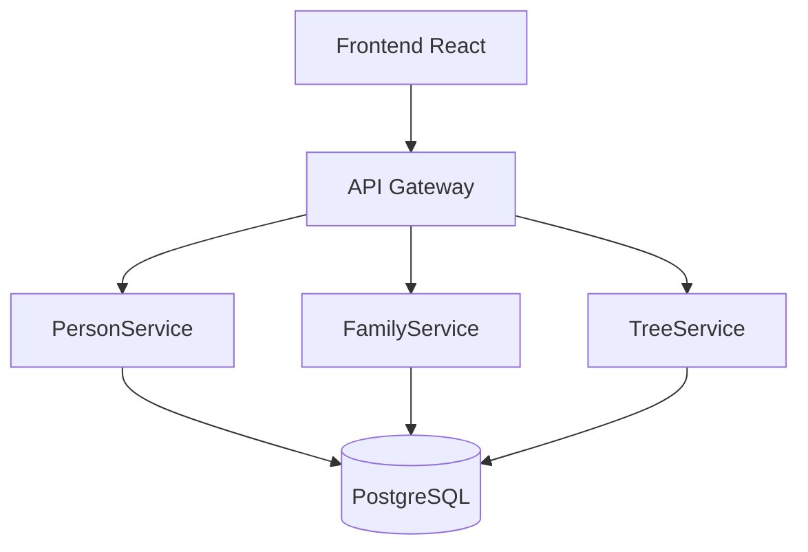

# 🏗️ Architecture GegeDot

## Vue d'ensemble

GegeDot utilise une architecture microservices moderne avec séparation claire entre le frontend et le backend, permettant une évolutivité et une maintenabilité optimales.

## 🎯 Principes Architecturaux

### 1. Séparation des Responsabilités
- **Frontend** : Interface utilisateur et logique de présentation
- **Backend** : Logique métier et gestion des données
- **Base de données** : Persistance des données

### 2. Microservices
Chaque service a une responsabilité unique :
- **PersonService** : Gestion des personnes
- **FamilyService** : Gestion des relations
- **TreeService** : Construction des arbres
- **AuthService** : Authentification

### 3. API-First
- Toutes les communications via API REST
- Documentation OpenAPI/Swagger
- Versioning des APIs

## 📁 Structure du Projet

```
gegeDot/
├── backend/                 # Services .NET Core
│   ├── src/
│   │   ├── GegeDot.API/     # API Gateway
│   │   ├── GegeDot.Core/    # Modèles et interfaces
│   │   ├── GegeDot.Infrastructure/ # Accès aux données
│   │   └── GegeDot.Services/ # Logique métier
│   ├── tests/
│   └── docker-compose.yml
├── frontend/                # Application React
│   ├── src/
│   │   ├── components/      # Composants React
│   │   ├── services/        # Services API
│   │   ├── types/          # Types TypeScript
│   │   └── utils/          # Utilitaires
│   └── public/
├── docs/                   # Documentation
├── scripts/                # Scripts de déploiement
└── docker-compose.yml      # Orchestration complète
```

## 🔄 Flux de Données



## 🗄️ Modèle de Données

### Entités Principales

#### Person
```csharp
public class Person
{
    public int Id { get; set; }
    public string FirstName { get; set; }
    public string LastName { get; set; }
    public DateTime? BirthDate { get; set; }
    public DateTime? DeathDate { get; set; }
    public string? BirthPlace { get; set; }
    public string? PhotoUrl { get; set; }
    public string? Biography { get; set; }
    public List<Relationship> Relationships { get; set; }
}
```

#### Relationship
```csharp
public class Relationship
{
    public int Id { get; set; }
    public int Person1Id { get; set; }
    public int Person2Id { get; set; }
    public RelationshipType Type { get; set; }
    public DateTime? StartDate { get; set; }
    public DateTime? EndDate { get; set; }
    public Person Person1 { get; set; }
    public Person Person2 { get; set; }
}

public enum RelationshipType
{
    Parent,
    Child,
    Spouse,
    Sibling
}
```

## 🔐 Sécurité

### Phase 1 (MVP)
- CORS configuré
- Validation des entrées
- Pas d'authentification

### Phase 2
- JWT Authentication
- Authorization basée sur les rôles
- HTTPS obligatoire
- Rate limiting

## 📊 Performance

### Stratégies d'Optimisation
1. **Caching** : Redis pour les arbres fréquemment consultés
2. **Pagination** : Pour les listes de personnes
3. **Lazy Loading** : Chargement des relations à la demande
4. **CDN** : Pour les images et assets statiques

## 🚀 Déploiement

### Environnements
- **Development** : Local avec Docker
- **Staging** : Railway.app
- **Production** : Railway.app + Netlify

### CI/CD Pipeline
```yaml
# GitHub Actions
1. Tests unitaires
2. Build Docker images
3. Deploy to staging
4. Tests d'intégration
5. Deploy to production
```

## 🔧 Configuration

### Variables d'Environnement
```env
# Backend
ASPNETCORE_ENVIRONMENT=Development
ConnectionStrings__DefaultConnection=Host=localhost;Database=gegeDot;Username=postgres;Password=password
JWT__SecretKey=your-secret-key
JWT__Issuer=GegeDot
JWT__Audience=GegeDot-Users

# Frontend
REACT_APP_API_URL=http://localhost:5000
REACT_APP_ENVIRONMENT=development
```

## 📈 Monitoring

### Métriques
- Temps de réponse des APIs
- Taux d'erreur
- Utilisation de la base de données
- Performance du frontend

### Outils
- Application Insights (Azure)
- Sentry (Gestion d'erreurs)
- Google Analytics (Frontend)

## 🔄 Évolutivité

### Horizontal Scaling
- Load balancer pour les APIs
- Base de données en cluster
- CDN pour les assets

### Vertical Scaling
- Augmentation des ressources serveur
- Optimisation des requêtes
- Mise en cache avancée

## 🧪 Tests

### Stratégie de Tests
- **Unit Tests** : 80% de couverture
- **Integration Tests** : APIs et base de données
- **E2E Tests** : Scénarios utilisateur complets

### Outils
- xUnit (.NET)
- Jest (React)
- Cypress (E2E)

