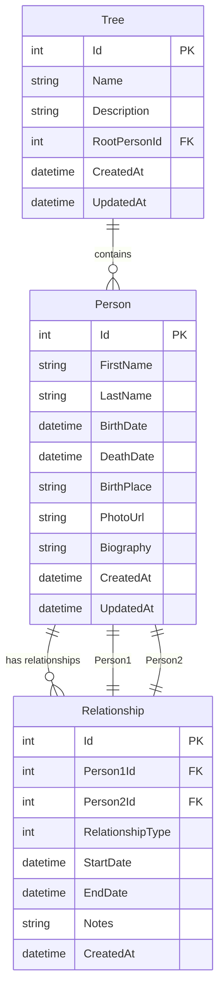

# 🗄️ Schéma de Base de Données - GegeDot

## Vue d'ensemble

Le schéma de base de données est conçu pour gérer efficacement les arbres généalogiques avec une structure flexible permettant de représenter toutes les relations familiales possibles.

## 📊 Diagramme ER



## 🏗️ Tables Détaillées

### 1. Person (Personnes)

```sql
CREATE TABLE Persons (
    Id SERIAL PRIMARY KEY,
    FirstName VARCHAR(100) NOT NULL,
    LastName VARCHAR(100) NOT NULL,
    MiddleName VARCHAR(100),
    BirthDate DATE,
    DeathDate DATE,
    BirthPlace VARCHAR(200),
    DeathPlace VARCHAR(200),
    PhotoUrl VARCHAR(500),
    Biography TEXT,
    Gender CHAR(1) CHECK (Gender IN ('M', 'F', 'O')), -- M=Male, F=Female, O=Other
    IsAlive BOOLEAN DEFAULT true,
    CreatedAt TIMESTAMP DEFAULT CURRENT_TIMESTAMP,
    UpdatedAt TIMESTAMP DEFAULT CURRENT_TIMESTAMP
);

-- Index pour les recherches
CREATE INDEX IX_Persons_LastName ON Persons(LastName);
CREATE INDEX IX_Persons_BirthDate ON Persons(BirthDate);
CREATE INDEX IX_Persons_FullName ON Persons(FirstName, LastName);
```

### 2. Relationship (Relations)

```sql
CREATE TABLE Relationships (
    Id SERIAL PRIMARY KEY,
    Person1Id INTEGER NOT NULL REFERENCES Persons(Id) ON DELETE CASCADE,
    Person2Id INTEGER NOT NULL REFERENCES Persons(Id) ON DELETE CASCADE,
    RelationshipType INTEGER NOT NULL, -- Enum: 1=Parent, 2=Child, 3=Spouse, 4=Sibling
    StartDate DATE,
    EndDate DATE,
    Notes TEXT,
    IsActive BOOLEAN DEFAULT true,
    CreatedAt TIMESTAMP DEFAULT CURRENT_TIMESTAMP,
    
    -- Contraintes
    CONSTRAINT CHK_DifferentPersons CHECK (Person1Id != Person2Id),
    CONSTRAINT CHK_ValidDateRange CHECK (EndDate IS NULL OR StartDate IS NULL OR EndDate >= StartDate)
);

-- Index pour les requêtes de relations
CREATE INDEX IX_Relationships_Person1 ON Relationships(Person1Id);
CREATE INDEX IX_Relationships_Person2 ON Relationships(Person2Id);
CREATE INDEX IX_Relationships_Type ON Relationships(RelationshipType);
```

### 3. Tree (Arbres Généalogiques)

```sql
CREATE TABLE Trees (
    Id SERIAL PRIMARY KEY,
    Name VARCHAR(200) NOT NULL,
    Description TEXT,
    RootPersonId INTEGER REFERENCES Persons(Id) ON DELETE SET NULL,
    IsPublic BOOLEAN DEFAULT false,
    CreatedAt TIMESTAMP DEFAULT CURRENT_TIMESTAMP,
    UpdatedAt TIMESTAMP DEFAULT CURRENT_TIMESTAMP
);

CREATE INDEX IX_Trees_RootPerson ON Trees(RootPersonId);
```

### 4. User (Utilisateurs - Phase 2)

```sql
CREATE TABLE Users (
    Id SERIAL PRIMARY KEY,
    Username VARCHAR(50) UNIQUE NOT NULL,
    Email VARCHAR(100) UNIQUE NOT NULL,
    PasswordHash VARCHAR(255) NOT NULL,
    FirstName VARCHAR(100),
    LastName VARCHAR(100),
    IsActive BOOLEAN DEFAULT true,
    CreatedAt TIMESTAMP DEFAULT CURRENT_TIMESTAMP,
    LastLoginAt TIMESTAMP
);

CREATE INDEX IX_Users_Username ON Users(Username);
CREATE INDEX IX_Users_Email ON Users(Email);
```

### 5. UserTreeAccess (Accès aux Arbres - Phase 2)

```sql
CREATE TABLE UserTreeAccess (
    Id SERIAL PRIMARY KEY,
    UserId INTEGER NOT NULL REFERENCES Users(Id) ON DELETE CASCADE,
    TreeId INTEGER NOT NULL REFERENCES Trees(Id) ON DELETE CASCADE,
    AccessLevel INTEGER NOT NULL, -- 1=Read, 2=Write, 3=Admin
    GrantedAt TIMESTAMP DEFAULT CURRENT_TIMESTAMP,
    
    UNIQUE(UserId, TreeId)
);
```

## 🔧 Enums et Types

### RelationshipType (C#)
```csharp
public enum RelationshipType
{
    Parent = 1,
    Child = 2,
    Spouse = 3,
    Sibling = 4,
    Grandparent = 5,
    Grandchild = 6,
    Uncle = 7,
    Aunt = 8,
    Cousin = 9,
    StepParent = 10,
    StepChild = 11,
    AdoptedParent = 12,
    AdoptedChild = 13
}
```

### Gender (C#)
```csharp
public enum Gender
{
    Male = 'M',
    Female = 'F',
    Other = 'O'
}
```

## 📝 Données de Test

### Insertion de Données Exemple

```sql
-- Insérer des personnes
INSERT INTO Persons (FirstName, LastName, BirthDate, Gender) VALUES
('Jean', 'Dupont', '1950-05-15', 'M'),
('Marie', 'Martin', '1952-08-20', 'F'),
('Pierre', 'Dupont', '1980-03-10', 'M'),
('Sophie', 'Dupont', '1982-07-25', 'F');

-- Insérer des relations
INSERT INTO Relationships (Person1Id, Person2Id, RelationshipType) VALUES
(1, 3, 1), -- Jean est parent de Pierre
(2, 3, 1), -- Marie est parent de Pierre
(1, 4, 1), -- Jean est parent de Sophie
(2, 4, 1), -- Marie est parent de Sophie
(1, 2, 3), -- Jean et Marie sont mariés
(3, 4, 4); -- Pierre et Sophie sont frères/sœurs
```

## 🔍 Requêtes Utiles

### Obtenir tous les enfants d'une personne
```sql
SELECT p.* 
FROM Persons p
JOIN Relationships r ON p.Id = r.Person2Id
WHERE r.Person1Id = @PersonId 
AND r.RelationshipType = 1; -- Parent
```

### Obtenir les parents d'une personne
```sql
SELECT p.* 
FROM Persons p
JOIN Relationships r ON p.Id = r.Person1Id
WHERE r.Person2Id = @PersonId 
AND r.RelationshipType = 1; -- Parent
```

### Construire un arbre généalogique (récursif)
```sql
WITH RECURSIVE FamilyTree AS (
    -- Point de départ (racine)
    SELECT Id, FirstName, LastName, 0 as Level
    FROM Persons 
    WHERE Id = @RootPersonId
    
    UNION ALL
    
    -- Relations parent-enfant
    SELECT p.Id, p.FirstName, p.LastName, ft.Level + 1
    FROM Persons p
    JOIN Relationships r ON p.Id = r.Person2Id
    JOIN FamilyTree ft ON r.Person1Id = ft.Id
    WHERE r.RelationshipType = 1 -- Parent
    AND ft.Level < 10 -- Limite de profondeur
)
SELECT * FROM FamilyTree ORDER BY Level, FirstName;
```

## 🚀 Optimisations

### Index Composés
```sql
-- Pour les recherches de relations
CREATE INDEX IX_Relationships_Person1_Type ON Relationships(Person1Id, RelationshipType);
CREATE INDEX IX_Relationships_Person2_Type ON Relationships(Person2Id, RelationshipType);

-- Pour les recherches de personnes
CREATE INDEX IX_Persons_Name_Birth ON Persons(LastName, FirstName, BirthDate);
```

### Vues Matérialisées (PostgreSQL)
```sql
-- Vue pour les statistiques des arbres
CREATE MATERIALIZED VIEW TreeStatistics AS
SELECT 
    t.Id as TreeId,
    t.Name,
    COUNT(DISTINCT p.Id) as PersonCount,
    COUNT(DISTINCT r.Id) as RelationshipCount,
    MAX(p.BirthDate) as LatestBirth,
    MIN(p.BirthDate) as EarliestBirth
FROM Trees t
LEFT JOIN Persons p ON EXISTS (
    SELECT 1 FROM Relationships r 
    WHERE (r.Person1Id = p.Id OR r.Person2Id = p.Id)
)
LEFT JOIN Relationships r ON r.Person1Id = p.Id OR r.Person2Id = p.Id
GROUP BY t.Id, t.Name;

-- Rafraîchir périodiquement
REFRESH MATERIALIZED VIEW TreeStatistics;
```

## 🔒 Sécurité

### Contraintes de Données
- Validation des dates (naissance < décès)
- Contrôle des relations circulaires
- Limitation de la profondeur des arbres

### Permissions (Phase 2)
- Accès en lecture seule par défaut
- Permissions granulaires par arbre
- Audit trail des modifications

## 📊 Métriques et Monitoring

### Requêtes de Performance
```sql
-- Statistiques des tables
SELECT 
    schemaname,
    tablename,
    n_tup_ins as inserts,
    n_tup_upd as updates,
    n_tup_del as deletes
FROM pg_stat_user_tables;

-- Taille des tables
SELECT 
    tablename,
    pg_size_pretty(pg_total_relation_size(tablename::regclass)) as size
FROM pg_tables 
WHERE schemaname = 'public';
```

