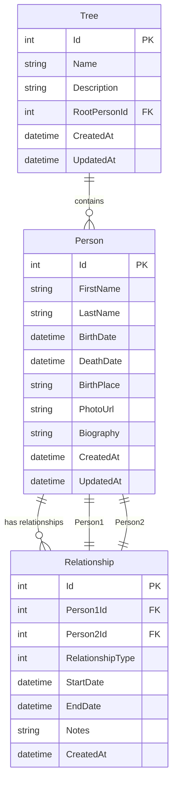

# 🗄️ Schéma de Base de Données MySQL - GegeDot

## Vue d'ensemble

Le schéma de base de données MySQL est optimisé pour gérer efficacement les arbres généalogiques avec une structure flexible permettant de représenter toutes les relations familiales possibles.

## 📊 Diagramme ER



## 🏗️ Tables Détaillées

### 1. Person (Personnes)

```sql
CREATE TABLE Persons (
    Id INT AUTO_INCREMENT PRIMARY KEY,
    FirstName VARCHAR(100) NOT NULL,
    LastName VARCHAR(100) NOT NULL,
    MiddleName VARCHAR(100),
    BirthDate DATE,
    DeathDate DATE,
    BirthPlace VARCHAR(200),
    DeathPlace VARCHAR(200),
    PhotoUrl VARCHAR(500),
    Biography TEXT,
    Gender ENUM('M', 'F', 'O') DEFAULT 'M', -- M=Male, F=Female, O=Other
    IsAlive BOOLEAN DEFAULT TRUE,
    CreatedAt TIMESTAMP DEFAULT CURRENT_TIMESTAMP,
    UpdatedAt TIMESTAMP DEFAULT CURRENT_TIMESTAMP ON UPDATE CURRENT_TIMESTAMP
);

-- Index pour les recherches
CREATE INDEX IX_Persons_LastName ON Persons(LastName);
CREATE INDEX IX_Persons_BirthDate ON Persons(BirthDate);
CREATE INDEX IX_Persons_FullName ON Persons(FirstName, LastName);
```

### 2. Relationship (Relations)

```sql
CREATE TABLE Relationships (
    Id INT AUTO_INCREMENT PRIMARY KEY,
    Person1Id INT NOT NULL,
    Person2Id INT NOT NULL,
    RelationshipType INT NOT NULL, -- Enum: 1=Parent, 2=Child, 3=Spouse, 4=Sibling
    StartDate DATE,
    EndDate DATE,
    Notes TEXT,
    IsActive BOOLEAN DEFAULT TRUE,
    CreatedAt TIMESTAMP DEFAULT CURRENT_TIMESTAMP,
    
    -- Clés étrangères
    FOREIGN KEY (Person1Id) REFERENCES Persons(Id) ON DELETE CASCADE,
    FOREIGN KEY (Person2Id) REFERENCES Persons(Id) ON DELETE CASCADE,
    
    -- Contraintes
    CONSTRAINT CHK_DifferentPersons CHECK (Person1Id != Person2Id),
    CONSTRAINT CHK_ValidDateRange CHECK (EndDate IS NULL OR StartDate IS NULL OR EndDate >= StartDate)
);

-- Index pour les requêtes de relations
CREATE INDEX IX_Relationships_Person1 ON Relationships(Person1Id);
CREATE INDEX IX_Relationships_Person2 ON Relationships(Person2Id);
CREATE INDEX IX_Relationships_Type ON Relationships(RelationshipType);
```

### 3. Tree (Arbres Généalogiques)

```sql
CREATE TABLE Trees (
    Id INT AUTO_INCREMENT PRIMARY KEY,
    Name VARCHAR(200) NOT NULL,
    Description TEXT,
    RootPersonId INT,
    IsPublic BOOLEAN DEFAULT FALSE,
    CreatedAt TIMESTAMP DEFAULT CURRENT_TIMESTAMP,
    UpdatedAt TIMESTAMP DEFAULT CURRENT_TIMESTAMP ON UPDATE CURRENT_TIMESTAMP,
    
    FOREIGN KEY (RootPersonId) REFERENCES Persons(Id) ON DELETE SET NULL
);

CREATE INDEX IX_Trees_RootPerson ON Trees(RootPersonId);
```

### 4. User (Utilisateurs - Phase 2)

```sql
CREATE TABLE Users (
    Id INT AUTO_INCREMENT PRIMARY KEY,
    Username VARCHAR(50) UNIQUE NOT NULL,
    Email VARCHAR(100) UNIQUE NOT NULL,
    PasswordHash VARCHAR(255) NOT NULL,
    FirstName VARCHAR(100),
    LastName VARCHAR(100),
    IsActive BOOLEAN DEFAULT TRUE,
    CreatedAt TIMESTAMP DEFAULT CURRENT_TIMESTAMP,
    LastLoginAt TIMESTAMP
);

CREATE INDEX IX_Users_Username ON Users(Username);
CREATE INDEX IX_Users_Email ON Users(Email);
```

### 5. UserTreeAccess (Accès aux Arbres - Phase 2)

```sql
CREATE TABLE UserTreeAccess (
    Id INT AUTO_INCREMENT PRIMARY KEY,
    UserId INT NOT NULL,
    TreeId INT NOT NULL,
    AccessLevel INT NOT NULL, -- 1=Read, 2=Write, 3=Admin
    GrantedAt TIMESTAMP DEFAULT CURRENT_TIMESTAMP,
    
    FOREIGN KEY (UserId) REFERENCES Users(Id) ON DELETE CASCADE,
    FOREIGN KEY (TreeId) REFERENCES Trees(Id) ON DELETE CASCADE,
    
    UNIQUE KEY UK_UserTreeAccess_User_Tree (UserId, TreeId)
);
```

## 🔧 Configuration MySQL

### Variables d'Environnement
```env
# Connection String MySQL
DATABASE_CONNECTION_STRING=Server=localhost;Database=gegeDot;Uid=root;Pwd=password;Port=3306;

# Ou avec MySQL Connector
DATABASE_CONNECTION_STRING=Server=localhost;Database=gegeDot;User=root;Password=password;Port=3306;
```

### Configuration Entity Framework
```csharp
// appsettings.json
{
  "ConnectionStrings": {
    "DefaultConnection": "Server=localhost;Database=gegeDot;Uid=root;Pwd=password;Port=3306;"
  }
}

// Program.cs
builder.Services.AddDbContext<GegeDotContext>(options =>
    options.UseMySql(connectionString, ServerVersion.AutoDetect(connectionString)));
```

## 📝 Données de Test

### Insertion de Données Exemple

```sql
-- Insérer des personnes
INSERT INTO Persons (FirstName, LastName, BirthDate, Gender) VALUES
('Jean', 'Dupont', '1950-05-15', 'M'),
('Marie', 'Martin', '1952-08-20', 'F'),
('Pierre', 'Dupont', '1980-03-10', 'M'),
('Sophie', 'Dupont', '1982-07-25', 'F');

-- Insérer des relations
INSERT INTO Relationships (Person1Id, Person2Id, RelationshipType) VALUES
(1, 3, 1), -- Jean est parent de Pierre
(2, 3, 1), -- Marie est parent de Pierre
(1, 4, 1), -- Jean est parent de Sophie
(2, 4, 1), -- Marie est parent de Sophie
(1, 2, 3), -- Jean et Marie sont mariés
(3, 4, 4); -- Pierre et Sophie sont frères/sœurs
```

## 🔍 Requêtes Utiles

### Obtenir tous les enfants d'une personne
```sql
SELECT p.* 
FROM Persons p
INNER JOIN Relationships r ON p.Id = r.Person2Id
WHERE r.Person1Id = ? 
AND r.RelationshipType = 1; -- Parent
```

### Obtenir les parents d'une personne
```sql
SELECT p.* 
FROM Persons p
INNER JOIN Relationships r ON p.Id = r.Person1Id
WHERE r.Person2Id = ? 
AND r.RelationshipType = 1; -- Parent
```

### Construire un arbre généalogique (récursif avec CTE)
```sql
WITH RECURSIVE FamilyTree AS (
    -- Point de départ (racine)
    SELECT Id, FirstName, LastName, 0 as Level
    FROM Persons 
    WHERE Id = ?
    
    UNION ALL
    
    -- Relations parent-enfant
    SELECT p.Id, p.FirstName, p.LastName, ft.Level + 1
    FROM Persons p
    INNER JOIN Relationships r ON p.Id = r.Person2Id
    INNER JOIN FamilyTree ft ON r.Person1Id = ft.Id
    WHERE r.RelationshipType = 1 -- Parent
    AND ft.Level < 10 -- Limite de profondeur
)
SELECT * FROM FamilyTree ORDER BY Level, FirstName;
```

## 🚀 Optimisations MySQL

### Index Composés
```sql
-- Pour les recherches de relations
CREATE INDEX IX_Relationships_Person1_Type ON Relationships(Person1Id, RelationshipType);
CREATE INDEX IX_Relationships_Person2_Type ON Relationships(Person2Id, RelationshipType);

-- Pour les recherches de personnes
CREATE INDEX IX_Persons_Name_Birth ON Persons(LastName, FirstName, BirthDate);
```

### Configuration MySQL pour Performance
```sql
-- Variables importantes dans my.cnf
[mysqld]
innodb_buffer_pool_size = 1G
innodb_log_file_size = 256M
query_cache_size = 64M
max_connections = 200
```

## 🔒 Sécurité

### Contraintes de Données
- Validation des dates (naissance < décès)
- Contrôle des relations circulaires
- Limitation de la profondeur des arbres

### Permissions (Phase 2)
```sql
-- Créer un utilisateur dédié
CREATE USER 'gegedot'@'localhost' IDENTIFIED BY 'secure_password';
GRANT SELECT, INSERT, UPDATE, DELETE ON gegeDot.* TO 'gegedot'@'localhost';
FLUSH PRIVILEGES;
```

## 📊 Métriques et Monitoring

### Requêtes de Performance
```sql
-- Statistiques des tables
SELECT 
    TABLE_NAME,
    TABLE_ROWS,
    DATA_LENGTH,
    INDEX_LENGTH
FROM information_schema.TABLES 
WHERE TABLE_SCHEMA = 'gegeDot';

-- Requêtes lentes
SHOW VARIABLES LIKE 'slow_query_log';
SHOW VARIABLES LIKE 'long_query_time';
```

## 🐳 Docker avec MySQL

### docker-compose.yml
```yaml
version: '3.8'
services:
  mysql:
    image: mysql:8.0
    container_name: gegeDot-mysql
    environment:
      MYSQL_ROOT_PASSWORD: password
      MYSQL_DATABASE: gegeDot
      MYSQL_USER: gegedot
      MYSQL_PASSWORD: password
    ports:
      - "3306:3306"
    volumes:
      - mysql_data:/var/lib/mysql
      - ./scripts/init.sql:/docker-entrypoint-initdb.d/init.sql
    command: --default-authentication-plugin=mysql_native_password

volumes:
  mysql_data:
```

### Script d'initialisation (init.sql)
```sql
-- Créer la base de données
CREATE DATABASE IF NOT EXISTS gegeDot;
USE gegeDot;

-- Exécuter les scripts de création des tables
SOURCE /docker-entrypoint-initdb.d/schema.sql;
SOURCE /docker-entrypoint-initdb.d/seed.sql;
```

## 🌐 Options de Déploiement MySQL

### Options Gratuites
1. **PlanetScale** (MySQL compatible, serverless)
2. **Railway** (MySQL 8.0)
3. **Clever Cloud** (MySQL)
4. **Aiven** (MySQL, 1 mois gratuit)

### Configuration de Production
```env
# Variables d'environnement pour production
DATABASE_CONNECTION_STRING=Server=your-server.com;Database=gegeDot;Uid=username;Pwd=password;Port=3306;SslMode=Required;
```

## 🔧 Migration depuis PostgreSQL

Si tu veux migrer plus tard vers PostgreSQL, voici les principales différences :

| Aspect | MySQL | PostgreSQL |
|--------|-------|------------|
| AUTO_INCREMENT | `AUTO_INCREMENT` | `SERIAL` |
| ENUM | `ENUM('M','F','O')` | `CHECK (Gender IN ('M','F','O'))` |
| Boolean | `BOOLEAN` | `BOOLEAN` |
| Text | `TEXT` | `TEXT` |
| Timestamps | `TIMESTAMP` | `TIMESTAMP` |

MySQL est parfait pour commencer et apprendre ! 🚀
